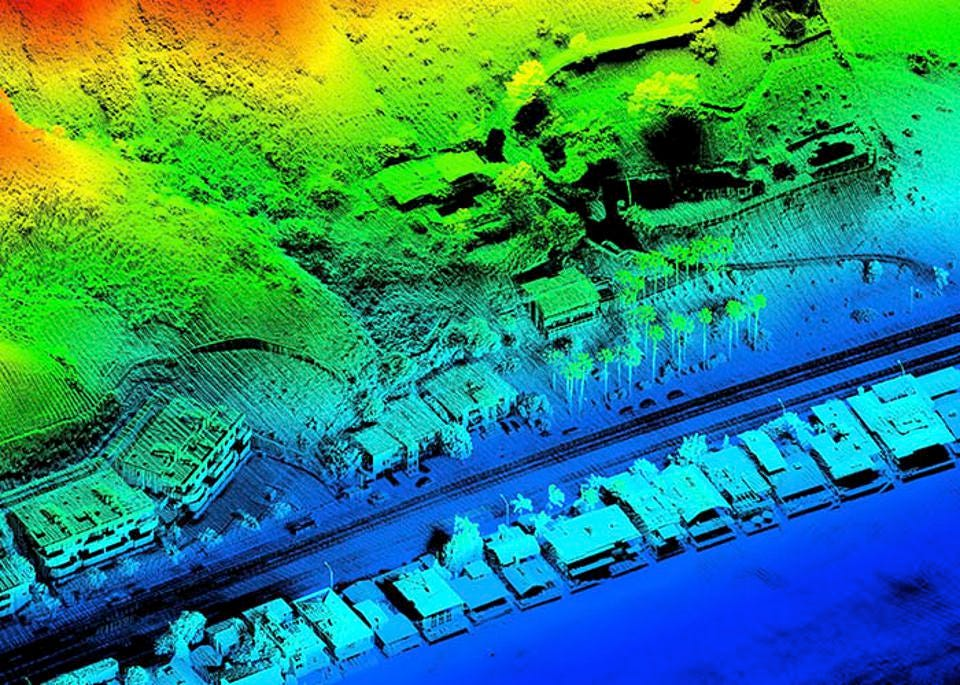

```{r setup, include=FALSE}
library(xaringan)
library(xaringanthemer)
library(xaringanExtra)
library(knitr)
library(emo)
library(knitcitations)
library(RefManageR)
BibOptions(check.entries = FALSE, 
           bib.style = "authoryear", 
           cite.style = "authoryear", 
           style = "markdown", 
           hyperlink = TRUE, 
           dashed = FALSE, 
           no.print.fields=c("doi", "url", "urldate", "issn"))
myBib <- ReadBib("./reference.bib", check = FALSE)
```

class: inverse, center, middle

# Hello LiDAR (FEAT.RADAR) `r emo::ji("hand")`

---

# Summary

## LiDAR
 * **Light** Detection And Ranging
 * to measure and scan the return time by emitting millions of laser pulses per second
 * to create high-resolution models of ground elevation with a vertical accuracy of 10cm

```{r echo=FALSE, out.width= '55%', fig.align='center'}

```
.center[LiDAR sensor image. [Source:Forbes](https://www.forbes.com/sites/sabbirrangwala/2020/04/12/there-must-be-860-ways-to-build-an-av-lidarpart-1/?sh=48144d69545c)]  

---

# Summary

## LiDAR
.pull-left[
* High precision 
* Measure elevation and orientation accurately
* Detect temperature and object 
* Scan surroundings at night
]
 
.pull-right[ 
* High power consumption
* Not suitable for extensive navigation due to sensor limitations
* Highly influenced by the environment (e.g. humidity, snow, rain, fog etc.)
]


## RADAR
 * **RAdio** Detection And Ranging
 * to determine the distance, angle of objects relative to the site using radio waves
 * LiDAR and RADAR are used complementarily!

---

# Application

## LiDAR
 * Mounted on aircraft or satellites for precise geographical and environmental observations
 * a crackdown on motor vehicle speed violations
 * Laser scanner for 3D image restoration
 * 3D image sensor for driverless vehicles

## RADAR
 * Detects aircraft, ships, spacecraft, miles, cars, and terrain
 * Finding the depth of the deep sea 
 * Used for weather observation, emergency braking devices of vehicles and rear detection system

#### **Both** are most recently used in **self-driving car technology** `r emo::ji("car")`

---

# Reflection 

* Learning Lidar as one of the remote sensing data measuring devices, I was surprised as **we use cutting-edge technology in our daily lives.** For example, I thought it was used only for aerial photography, but even radio waves are used in microwave ovens!

* I am looking forward to how this technology, which is currently the core of autonomous vehicle development, will change our future. And I wish this technology could use as **a solution for climate change.**

```{r echo=FALSE, out.width= '55%', fig.align='center'}
knitr::include_graphics('images/6c6a37ee9787cc1585c5ce466b50f9da.gif')
```
.center[[Source:Pinterest](https://www.pinterest.com/pin/93590498485503110/)]  

---

# Reference

```{r echo=FALSE, results='asis', warning=FALSE, message=FALSE}
PrintBibliography(myBib)
```

---

class: inverse, center, middle

# DONE! Fancy a cuppa? `r emo::ji("tea")`

